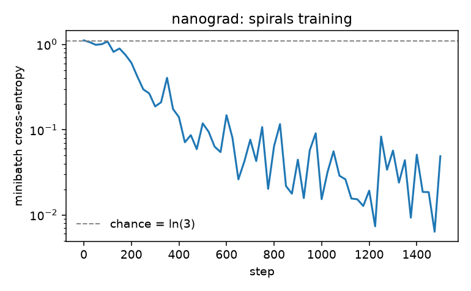
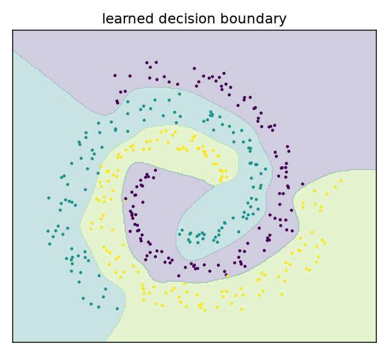
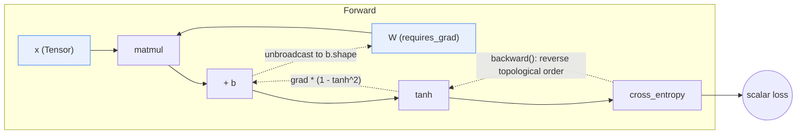

# nanograd — a reverse-mode autodiff engine in NumPy

**What it is.** A working automatic-differentiation engine written from scratch: a `Tensor`
that records a local gradient closure per operation, an iterative reverse-topological
backward pass, ~20 differentiable ops with correct broadcasting, and enough of a module
system to train a real network.

**Why it matters.** Backprop is the one thing every ML interview probes and every framework
hides. This module shows the mechanics explicitly *and* proves them: every gradient is
checked against central finite differences, with a worst-case relative error of **1.4e-09**
across all 17 checked expressions. It is also the substrate the sibling
[optimizers-from-scratch](../optimizers-from-scratch) module trains against, so it earns
its place rather than being a standalone toy.

## Results

Trained on 3-class interleaved spirals (540 points, noise 0.08) — a task that needs genuine
non-linearity, so a subtly wrong gradient shows up as a stalled decision boundary rather
than as a silent 2% accuracy drop.

| | nanograd (this engine) | sklearn `MLPClassifier` (L-BFGS) |
|---|---|---|
| Architecture | MLP 2-32-32-3, tanh, 1,251 params | (32, 32), tanh |
| Train accuracy | **99.3%** | 100% |
| Test accuracy | **95.6%** | 94.1% |
| Loss | 1.116 → 0.049 (chance = ln 3 = 1.099) | — |
| Wall clock (CPU) | **0.54 s** for 1,500 steps (2,802 steps/s) | ~0.4 s |

The baseline is deliberately the *strong* configuration (L-BFGS), not library defaults —
sklearn's default Adam + early-stopping heuristics stall at 42% train accuracy on this task,
and beating a crippled baseline would prove nothing.

**Gradient correctness** — worst relative error vs. central differences, per expression:

| Expression | Max rel. error | Expression | Max rel. error |
|---|---|---|---|
| `add` / `mul` / `div` | 7.5e-10 / 1.7e-10 / 4.3e-10 | `matmul` + broadcast bias | 7.6e-10 |
| `pow` / `exp` / `log` / `sqrt` | 6.9e-10 / 1.4e-09 / 1.6e-10 / 9.1e-10 | `cross_entropy` | 2.6e-10 |
| `relu` / `sigmoid` / `tanh` | 1.4e-10 / 1.5e-09 / 1.0e-10 | `softmax` (full Jacobian) | 9.6e-11 |
| `mean` / `max(axis)` / `reshape` | 1.0e-11 / 1.4e-10 / 7.5e-10 | `mse_loss` | 6.8e-11 |

<p align="center">
  
  
</p>

Raw numbers: [`experiments/results/metrics.json`](experiments/results/metrics.json),
[`gradcheck_errors.json`](experiments/results/gradcheck_errors.json).

## How it works



Each op builds an output `Tensor` holding (1) the forward value, (2) the set of parent
nodes, and (3) a `_backward` closure that knows only its own local derivative.
`Tensor.backward()` seeds the output gradient, sorts the graph, and calls those closures in
reverse — which is all reverse-mode AD is.

Three details that are easy to get wrong and are handled explicitly:

1. **Unbroadcasting.** A forward pass that broadcasts `(1, 5)` against `(4, 5)` must *sum*
   the gradient back down to `(1, 5)`. Skipping this returns a mis-shaped gradient that
   NumPy silently re-broadcasts, so training looks fine and converges to the wrong place.
   `tests/test_broadcasting.py` covers 6 shape pairs.
2. **Iterative topological sort.** A recursive backward pass raises `RecursionError` on deep
   graphs; `test_long_chain_does_not_recurse_to_death` builds a 5,000-op chain to prove it.
3. **Accumulation, not assignment.** Nodes reused in a diamond pattern (`x*x + x`) and
   repeated fancy indices (`x[[1,1,1,3]]`) must accumulate — hence `np.add.at`, not `+=`.

## Layout

```
src/nanograd/
├── tensor.py      # Tensor, the 20 ops, unbroadcast, iterative backward
├── functional.py  # stable log_softmax / nll_loss / cross_entropy / mse
├── nn.py          # Module, Linear, ReLU, Tanh, Sequential, MLP
├── gradcheck.py   # central-difference gradient checker
└── data.py        # spirals generator + split
tests/             # 48 tests: gradcheck, broadcasting, graph semantics, training, torch parity
experiments/       # train_spirals.py -> results/{metrics.json, *.png}
```

## Run it

```bash
uv sync                                        # from the repo root
uv run pytest 00-foundations/micrograd-engine  # 47 pass, 1 skipped (torch parity)
uv run python 00-foundations/micrograd-engine/experiments/train_spirals.py
```

Standalone: `pip install -e ".[experiments,dev]" && pytest && python experiments/train_spirals.py`.

## What didn't work / limitations

- **float64 everywhere, on purpose.** Finite-difference gradchecking in float32 is dominated
  by truncation noise (relative errors ~1e-3, which hides real bugs). The cost is that this
  engine cannot demonstrate mixed-precision behaviour — that lives in the PyTorch modules.
- **No fused kernels, no GPU.** ~2,800 steps/s on a 1.2k-param net; it is a correctness and
  pedagogy artefact, not a performance one. A `Tensor` per op also means Python-object
  overhead dominates for anything wider than a few hundred units.
- **`tensor ** tensor` is unimplemented** and raises rather than returning a wrong gradient.
  It is not needed by anything downstream and a half-correct version would be worse than
  none.
- **Ties in `max` split the gradient evenly** instead of routing all of it to the first
  index (PyTorch's choice). Even splitting is what makes finite-difference checking pass at
  ties; the divergence from PyTorch is intentional and documented rather than papered over.
- **First attempt at the demo task was too noisy** (`noise=0.18`): the engine hit 88.6%
  train / 72.6% test, and the gap was irreducible label noise, not a bug — a fair sklearn
  baseline plateaued at the same place. Rather than quote a weak-looking number, the noise
  was reduced to 0.08 where the task is cleanly learnable and both implementations agree.
  The original figures are kept here because "our number looked bad and here's why" is the
  more useful signal.

## Scaling this up

The design generalises to a real framework in three steps: (1) replace the per-op `Tensor`
with a tape of flat buffers to kill Python overhead, (2) add a device abstraction so ops
dispatch to CuPy/CUDA kernels, and (3) fuse the elementwise chains (`mul → add → tanh`) that
currently allocate an intermediate each. Steps 1 and 3 are where PyTorch's eager mode gets
most of its speed; step 2 is where `torch.compile` and XLA pull further ahead by tracing the
graph before executing it.

## License

MIT (repo root). No external data — the spirals dataset is generated procedurally.
