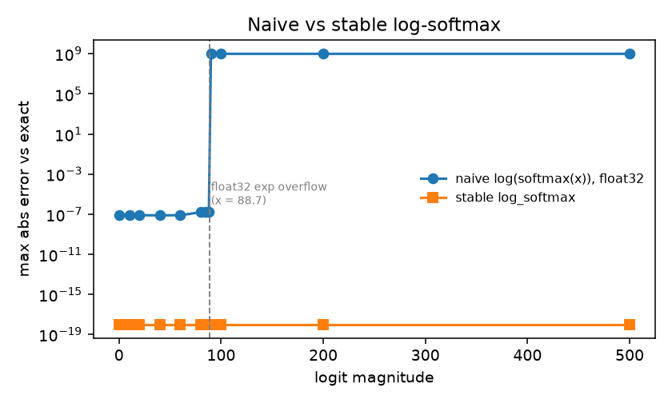
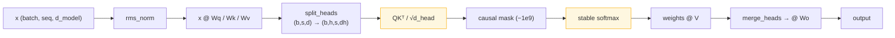

# nnprim — transformer primitives, written out and measured

**What it is.** The numerical guts of a transformer block in NumPy: stable
softmax/logsumexp/cross-entropy, LayerNorm and RMSNorm with **hand-derived backward passes**,
multi-head attention built from raw tensor ops (no `nn.MultiheadAttention`), and the
initialisation schemes that decide whether a deep stack trains at all.

**Why it matters.** Two of the highest-frequency real-world training failures are `nan` loss
from an unstable softmax and a silently wrong LayerNorm gradient. This module locates both
precisely: it *measures* the logit at which each dtype breaks, and it checks every derived
gradient against finite differences. It is also the layer the [M2 transformer
module](../../02-deep-learning/transformers-from-scratch) is built on top of.

## Results

### 1. Exactly where the naive formulas break

| dtype | `exp` overflows at | naive softmax first `nan` | stable softmax |
|---|---|---|---|
| float16 | **11.09** | logit 12 | finite |
| float32 | **88.72** | logit 89 | finite |
| float64 | **709.78** | logit 710 | finite |

float16's threshold of 11.09 is the number that matters in practice: attention logits reach
that range routinely at `d_head=64` if the `1/√d_k` scale is dropped, which is why
mixed-precision kernels compute softmax in fp32 even when everything around it is fp16.

Max absolute error vs. the exact result, float32 logits:

| Logit magnitude | 0–80 | 85 | 88 | **90** | 500 |
|---|---|---|---|---|---|
| naive `log(softmax(x))` | 7.8e-08 | 1.6e-07 | 1.6e-07 | **`nan`** | **`nan`** |
| stable `log_softmax` | 0.0 | 0.0 | 0.0 | **0.0** | **0.0** |

The stable path is *exact* (0.0 error) because shifting by the row max is an
algebraic identity, not an approximation. Underflow is handled too: at logits `[0, -800]`,
`log(softmax(x))` returns `-inf` while `log_softmax` returns the correct `-800.0`, and
cross-entropy on a confidently-wrong prediction (`logits=[500, -500]`, label 1) yields a
finite loss of **1000.0** instead of `nan`.

<p align="center"></p>

### 2. Hand-derived gradients vs. finite differences

| Quantity | Max abs error |
|---|---|
| LayerNorm `dx` (all three terms) | 8.4e-10 |
| LayerNorm `dγ` / `dβ` | 7.0e-10 / 4.7e-10 |
| RMSNorm `dx` | 5.3e-10 |
| RMSNorm `dγ` | 6.4e-10 |
| softmax VJP | 2.3e-10 |

The LayerNorm backward pass has three terms because µ and σ each depend on every element of
the row:

$$\frac{\partial L}{\partial x} = \frac{1}{\sigma}\Big(g - \overline{g} - \hat{x}\,\overline{g\hat{x}}\Big),\qquad g = \frac{\partial L}{\partial y}\odot\gamma$$

Two tests pin this down beyond the numeric check: dropping the correction terms
(`dx = g/σ`, the common simplification) is shown to be **>0.05 wrong in absolute terms**, and
the true gradient is verified to be orthogonal to both `1` and `x̂` — it *must* be, since
LayerNorm's output cannot change under a shift or rescale of its input.

### 3. RMSNorm vs LayerNorm

| | Forward, 32×512×1024 activations | Centres the input? | Learned bias? |
|---|---|---|---|
| LayerNorm | 267.3 ms | yes | yes |
| **RMSNorm** | **150.8 ms (1.77× faster)** | no | no |

1.77× on CPU NumPy overstates the win a fused CUDA kernel sees (there the gap is smaller,
since both are memory-bound), but the direction is right and the reason is structural: one
pass over the row instead of two, one buffer instead of two. That is why Llama, Qwen, Gemma
and Mistral all use RMSNorm. RMSNorm's defining property — invariance to input scale but
*not* to input offset — is asserted directly in `tests/test_norm.py`.

### 4. Why the `1/√d_k` scale is load-bearing

Attention weight entropy over 32 keys at `d_head=64` (uniform would be ln 32 = 3.47 nats):

| | Entropy | Max attention weight |
|---|---|---|
| with `1/√d_k` | **2.98 nats** | — |
| without | **0.54 nats** | **0.99996** |

Without the scale the distribution collapses to near one-hot, and since
`∂softmax/∂x = p ⊙ (I − p)` vanishes as `p → onehot`, so does the gradient. The scale is not
a normalisation nicety — it is what keeps attention trainable.

### 5. Attention correctness

- Batched reshape/transpose implementation matches an explicit per-head Python loop to
  **1.1e-16** (causal and non-causal).
- **Causality is proven by perturbation**, not by inspecting the mask: adding 100 to the last
  token leaves every earlier output *bit-identical*, while the non-causal version changes
  position 0 immediately. An off-by-one in the triangle leaks exactly one future token and
  would pass a shape check.
- Attention with no positional encoding is verified **permutation-equivariant** — shuffling
  tokens shuffles outputs identically. This is the concrete reason RoPE/ALiBi exist, and it is
  testable rather than merely quotable.
- Output is verified to lie inside the elementwise min/max of `V` (it is a convex combination).

### 6. Initialisation, measured

| Scheme | Target variance | Measured (512×256) |
|---|---|---|
| Xavier uniform / normal | 2/(fan_in+fan_out) = 2.60e-03 | within 5% |
| Kaiming uniform / normal | 2/fan_in = 3.91e-03 | within 5% |
| Truncated normal (σ=0.02, ±2σ) | realised σ = 0.8796·0.02 | 0.01758 |
| GPT-2 residual scaling | σ/√(2N) | within 5% |

Two behavioural tests back these up: propagating activations through **8 ReLU layers** keeps
variance O(1) under Kaiming but decays it below 0.2 under Xavier (the missing factor of 2,
compounded), and the GPT-2 `1/√(2N)` output-projection rescaling is shown to bound
residual-stream variance where unscaled init lets it grow with depth. The truncated-normal row
is a practical gotcha: a config's `initializer_range=0.02` does **not** produce weights with
σ=0.02 — truncation shrinks it by 12%.

Raw numbers: [`experiments/results/stability_report.json`](experiments/results/stability_report.json).

## Layout



```
src/nnprim/
├── functional.py  # logsumexp, softmax, log_softmax, cross_entropy, sigmoid, gelu, silu,
│                  #   swiglu + the naive_* counterparts used by the stability report
├── norm.py        # layer_norm / rms_norm, forward and backward
├── attention.py   # scaled_dot_product_attention, split/merge_heads, MHA + naive reference
├── init.py        # xavier, kaiming, truncated_normal, residual_scaled_normal
└── gradcheck.py   # central-difference checker
tests/             # 44 tests across stability, norms, attention, init
experiments/       # stability_report.py -> results/{stability_report.json, stability.png}
```

## Run it

```bash
uv sync                                          # from the repo root
uv run pytest 00-foundations/nn-primitives       # 44 tests, ~6 s
uv run python 00-foundations/nn-primitives/experiments/stability_report.py
```

## What didn't work / limitations

- **`-1e9`, not `-inf`, for masked positions.** Using `-inf` makes a fully-masked row produce
  `nan` (`exp(-inf - -inf)`), which is a real bug in padded batches. `logsumexp` additionally
  guards against an all-`-inf` row explicitly. The cost is that `-1e9` is not exactly zero
  probability — it is `~0` at fp32 and *not* representable at fp16, where the mask value has
  to be `-65504`-safe. Handled here by keeping the softmax in float64.
- **The 1.77× RMSNorm speedup does not transfer directly to GPU.** Both norms are memory-bound
  in fused CUDA kernels, so the real gap is smaller. Quoting the NumPy number without that
  caveat would be misleading.
- **No backward pass for attention.** `scaled_dot_product_attention` is forward-only here; the
  gradient comes from autodiff in the PyTorch modules. Deriving it by hand would be nice
  symmetry but would duplicate what [nanograd](../micrograd-engine) already verifies, and a
  from-scratch FlashAttention-style backward is a genuine project rather than a primitive.
- **float64 throughout.** Same trade-off as the autodiff module: needed for meaningful
  finite-difference checks, but it means this module cannot itself demonstrate the fp16/bf16
  behaviour it measures thresholds for.
- **Only the exact GELU needs SciPy.** The tanh approximation (max abs deviation **4.7e-04**,
  measured) is pure NumPy and is what GPT-2 shipped, so the dependency is optional in practice.

## Scaling this up

The primitive that changes at scale is attention: materialising the `(seq, seq)` weight matrix
costs O(seq²) memory, which is what FlashAttention removes by tiling the computation and
recomputing the softmax statistics online (the same max-subtraction trick used here, applied
blockwise). The natural next step from this module is an online-softmax attention that never
holds the full score matrix — implemented in
[`02-deep-learning/transformers-from-scratch`](../../02-deep-learning/transformers-from-scratch).

## License

MIT (repo root). No external data.
