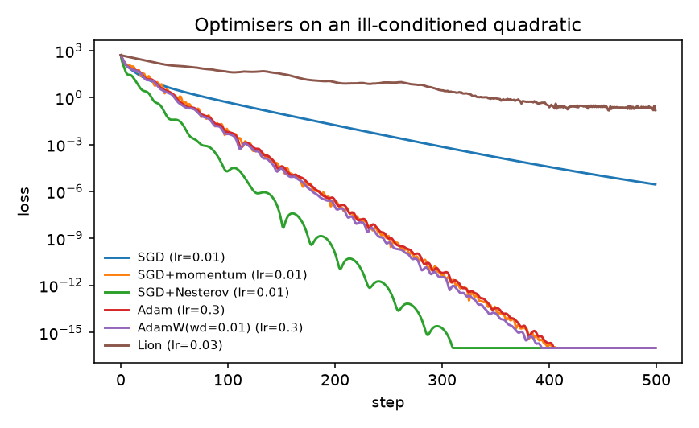
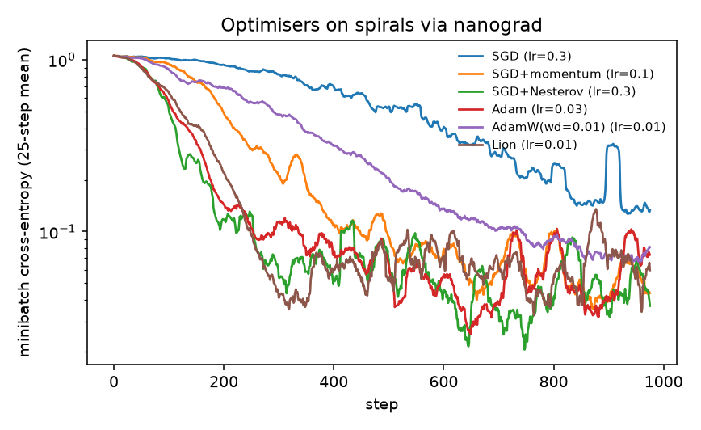
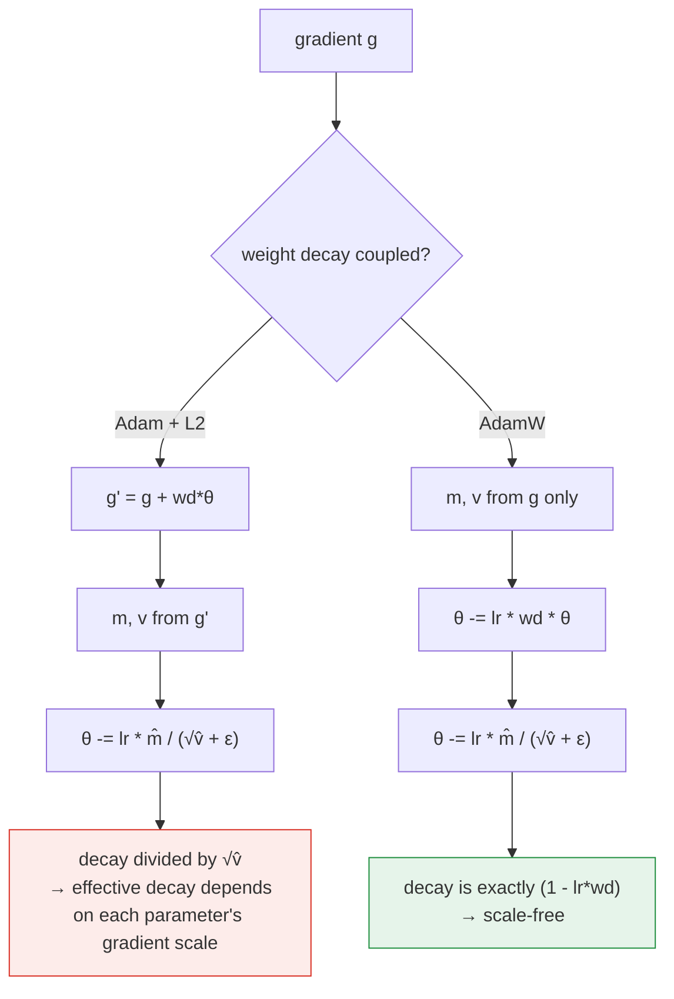

# nanoptim — optimisers and LR schedules from scratch

**What it is.** SGD (+ momentum/Nesterov), Adam, AdamW and Lion, plus cosine-with-warmup and
warmup-stable-decay schedules, implemented against a `.data`/`.grad` protocol so the same
code drives both plain NumPy parameters and the [nanograd](../micrograd-engine) autodiff
engine.

**Why it matters.** "Adam with weight decay" and "AdamW" are described interchangeably in
most tutorials and are *different algorithms*. This module doesn't cite the paper — it
measures the divergence, and the tests fail if the two implementations ever collapse into
each other. That, plus Lion's unit-magnitude update and the warmup-stable-decay shape used by
most 2024-2026 open pretraining runs, is the difference between having read about optimisers
and having implemented them.

## Results

### 1. Ill-conditioned quadratic (condition number 100, d=20, initial loss 525)

500 steps, per-optimiser learning-rate sweep over `{1e-4 … 1}` — comparing optimisers at one
shared LR measures the LR, not the optimiser.

| Optimiser | Best LR | Steps to 1e-6× initial loss | Final loss |
|---|---|---|---|
| SGD | 0.01 | 311 | 2.9e-06 |
| SGD + momentum | 0.01 | 123 | 3.8e-21 |
| **SGD + Nesterov** | 0.01 | **86** | **5.9e-27** |
| Adam | 0.3 | 129 | 7.2e-21 |
| AdamW (wd=0.01) | 0.3 | 123 | 1.6e-21 |
| Lion | 0.03 | never | 1.6e-01 |

Nesterov wins by 1.4x over heavy-ball momentum and 3.6x over plain SGD. Lion **fails to
converge at fixed LR** — its update has unit magnitude per coordinate, so without a decaying
schedule it can only oscillate inside a ball of radius ~lr around the optimum. That is a real
property of the algorithm, not a bug, and it is why every Lion recipe pairs it with a decay.

### 2. Rosenbrock (non-convex, curved valley, initial loss 24.2)

| Optimiser | Best LR | Final loss | Note |
|---|---|---|---|
| SGD | 0.003 | 8.1e-02 | crawls along the valley floor |
| **SGD + momentum** | 0.003 | **2.6e-07** | |
| SGD + Nesterov | 0.001 | 2.5e-03 | needed a smaller LR to stay stable |
| Adam | 1.0 | 4.2e-06 | |
| AdamW (wd=0.01) | 0.3 | 2.2e-02 | decay pulls away from the optimum at (1, 1) |
| Lion | 0.01 | 2.7e-02 | dipped under 1e-6× at step 290, then bounced back out |

Two honest findings worth more than a clean table: **AdamW loses to Adam here**, because
weight decay biases the solution towards the origin and this problem's optimum is at (1, 1) —
a reminder that decay is a prior, not a free win. And **Lion's "steps-to-target" number is
misleading in isolation**: it hit the target and then left, which is exactly the oscillation
described above.

### 3. Same optimisers on a real network (spirals via nanograd, MLP 2-32-32-3, 1,251 params)

1,000 steps, batch 64, identical data/init/batch order across optimisers, per-optimiser LR
sweep over `{1e-3 … 3e-1}`.

| Optimiser | Best LR | Test accuracy | Steps to 95% train | Final batch loss |
|---|---|---|---|---|
| SGD | 0.3 | 80.0% | 720 | 0.257 |
| **SGD + momentum** | 0.1 | **97.0%** | 320 | 0.058 |
| SGD + Nesterov | 0.3 | 96.3% | **240** | 0.027 |
| Adam | 0.03 | 94.8% | 200 | 0.050 |
| AdamW (wd=0.01) | 0.01 | 94.8% | 520 | 0.082 |
| Lion | 0.01 | 95.6% | 240 | 0.081 |

**Adam does not win.** On a 1.2k-parameter net with clean, well-conditioned inputs, tuned
SGD+momentum generalises 2.2 points better than tuned Adam. Adaptive methods earn their
reputation on ill-conditioned, sparse, high-dimensional problems (transformers), not on
everything — and the fact that this benchmark reproduces that distinction is the point of
running it at two scales.

### 4. Schedule ablation

| Schedule (Adam, quadratic, peak LR 0.3) | Final loss |
|---|---|
| constant | 7.2e-21 |
| cosine + 10% warmup | 3.2e-13 |
| WSD (2% warmup / 10% decay) | 3.4e-20 |

On the spirals net, adding cosine+warmup to the best configuration (SGD+momentum, lr=0.1)
*hurt* slightly: 97.0% → 96.3%. Schedules buy stability in long, large-batch runs where the
adaptive denominator is poorly estimated early; on a 1,000-step run that is already stable
they mostly cost you time at the peak LR. Reporting the win that didn't happen is more useful
than omitting the ablation.

<p align="center">
  
  
</p>

Raw numbers: [`convex_benchmark.json`](experiments/results/convex_benchmark.json),
[`spirals_benchmark.json`](experiments/results/spirals_benchmark.json).

## The AdamW claim, tested rather than asserted



`tests/test_adamw_decoupling.py` pins this down with four assertions:

- With `weight_decay=0` the two are bit-for-bit identical (so the test suite is measuring the
  decay, nothing else).
- Under AdamW with zero gradient, a weight follows exactly `(1 - lr·wd)^t`.
- Under Adam+L2 with zero gradient, the same weight moves **10x further** in one step
  (`0.1` vs `0.01`), because the decay term is divided by `√v̂` — which for a
  gradient-free parameter is just the decay term itself, so the ratio collapses to `1/wd`.
- Varying the gradient scale by 10<sup>4</sup> leaves AdamW's total shrinkage invariant to
  within 1e-9 while Adam+L2's changes measurably. This is the actual pathology; the ratio
  test is the one that would catch a regression.

## Layout

```
src/nanoptim/
├── optimizers.py  # Optimizer base, SGD (momentum/Nesterov), Adam, AdamW, Lion, clip_grad_norm_
└── schedules.py   # ConstantLR, CosineWithWarmup, WarmupStableDecay
tests/             # 30 tests: closed-form update checks, convergence, decoupling, schedules
experiments/       # benchmark_convex.py, benchmark_spirals.py -> results/{*.json, *.png}
```

## Run it

```bash
uv sync                                                # from the repo root
uv run pytest 00-foundations/optimizers-from-scratch   # 30 tests
uv run python 00-foundations/optimizers-from-scratch/experiments/benchmark_convex.py
uv run python 00-foundations/optimizers-from-scratch/experiments/benchmark_spirals.py
```

Total runtime: ~40 s on CPU, no GPU and no downloads.

## What didn't work / limitations

- **Lion needs a schedule.** Reported above rather than hidden: at fixed LR it never
  converges on either convex problem. Adding a decay fixes it, but a paper-faithful Lion at
  fixed LR is the honest comparison against fixed-LR Adam.
- **AdamW underperforms Adam on Rosenbrock**, because the objective's optimum is far from the
  origin. Weight decay is a prior about where good solutions live; it is wrong here.
- **These are small problems.** Nothing here demonstrates the regime where Adam's advantage
  is decisive (billion-parameter transformers with heavy-tailed gradient distributions).
  Scaling this up means measuring optimiser *memory* (Adam's 2 states vs Lion's 1 —
  a 33% saving on optimiser state, which is why Lion appears in memory-bound recipes) and
  sensitivity to LR at scale, neither of which is provable on a 1.2k-param net.
- **No fused/foreach implementation.** Each parameter is updated in a Python loop, so this is
  ~10-50x slower per step than `torch.optim` on a large model. Correctness and legibility
  were the goal; the sibling PyTorch modules use `torch.optim` for real runs.
- **No second-order or sharpness-aware methods** (Shampoo/SOAP, SAM, Muon). They are the
  interesting 2025-2026 frontier for pretraining, and adding one would strengthen this
  module — flagged in [`MAINTENANCE.md`](../../MAINTENANCE.md) as the highest-value follow-up
  here.

## References

- Loshchilov & Hutter, *Decoupled Weight Decay Regularization* (AdamW), ICLR 2019.
- Chen et al., *Symbolic Discovery of Optimization Algorithms* (Lion), NeurIPS 2023.
- Hu et al., *MiniCPM* (2024) — the warmup-stable-decay schedule and why it beats cosine for
  open runs with unknown token budgets.

## License

MIT (repo root). No external data — all objectives are generated in-process.
