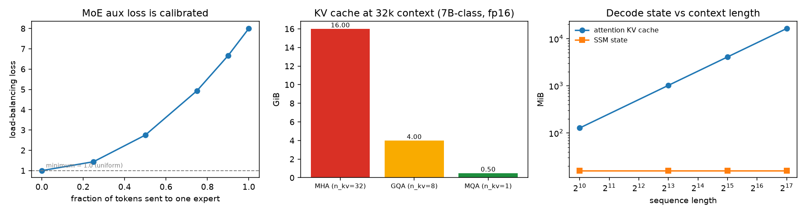
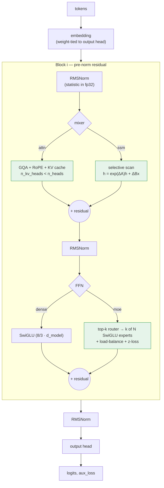

# nanoformer — transformer, MoE and selective-SSM blocks from raw tensor ops

**What it is.** Multi-head / grouped-query attention with RoPE, ALiBi, RMSNorm and a KV cache;
a Mixture-of-Experts FFN with top-k routing and calibrated auxiliary losses; a Mamba-style
selective state-space block with two scan implementations; and a small decoder LM that composes
them into dense, MoE and **hybrid SSM↔attention** stacks. No `nn.MultiheadAttention`, no
`nn.RMSNorm`, no fused scan kernel.

**Why it matters.** Every algorithm here exists twice — once in NumPy
(`nanoformer.reference`) and once in PyTorch (`nanoformer.torch_impl`) — and the torch tests
assert they agree numerically. The NumPy reference is independently pinned to closed-form
properties (RoPE's relative-position invariance, the exact minimum of the MoE auxiliary loss,
the FIR-convolution identity that selectivity gives up), so the PyTorch code is *verified*,
not merely plausible.

## Results — verified

Produced by `experiments/validate_reference.py`, NumPy float64 on CPU. Raw output:
[`reference_validation.json`](experiments/results/reference_validation.json).

### 1. Equivalence and property checks

| Claim | Measured |
|---|---|
| RoPE logit depends only on relative position (5 absolute positions, same offset) | **2.0e-15** relative deviation |
| RoPE is a rotation (norm preserved) | **1.8e-15** max abs error |
| KV cache: token-by-token decode == full forward (MHA / GQA / MQA) | **2.4e-15 / 1.8e-15 / 1.3e-15** |
| KV cache: prefill-then-decode == full forward | **≤ 9.4e-16** |
| Selective scan: chunked == sequential recurrence (chunk ∈ {1,4,16,32,128}) | **8.5e-14** worst case |
| Full SSM block: chunked == sequential | **2.1e-14** |
| Non-selective SSM == FIR convolution | **≤ 1e-12** |

The chunked scan is the interesting one: it computes the same recurrence via cumulative products
inside chunks, which is the structure a GPU associative-scan kernel exploits. A formulation that
is *nearly* the recurrence is a different model, so it is tested at five chunk sizes including 1
and one larger than the sequence.

### 2. The MoE auxiliary loss is calibrated, not just present

Switch-Transformer loss `N · Σ fᵢPᵢ`. The normalisation by `N` is what makes its minimum exactly
**1.0** at uniform routing for *any* expert count — which is why it can be added to the task loss
with a fixed coefficient.

| Routing | Loss (8 experts) |
|---|---|
| perfectly uniform | **1.0000** |
| 25% to one expert | 1.4375 |
| 50% to one expert | 2.7500 |
| 75% to one expert | 4.9375 |
| 90% to one expert | 6.6644 |
| total collapse | **8.0000** (= N) |

Verified across 4 / 8 / 16 / 64 experts: the minimum stays exactly 1.0. Also measured: at
initialisation the router is already near-balanced (0 dead experts, imbalance ratio 1.13) — so
**collapse is a training dynamic, not an init problem**, which is why the auxiliary loss must be
in the graph from step 0 rather than added once the loss curve looks wrong.

**Capacity dropping is a silent failure and is instrumented as one.** At
`capacity_factor=0.25`, **75.0% of token-expert assignments are dropped** and those tokens pass
through the residual unchanged, with no error raised. `MoEStats.tokens_dropped` exists so that
shows up in a log instead of as unexplained quality loss.

### 3. GQA: exactly how much memory it buys

Closed-form byte counts for a 7B-class shape (32 layers, 32 heads, head_dim 128, fp16, batch 1) —
exact, not timed, so hardware-independent:

| Config | Bytes/token (all layers) | 4k ctx | 32k ctx | 128k ctx | vs MHA |
|---|---|---|---|---|---|
| MHA (n_kv=32) | 524,288 | 2.00 GiB | **16.00 GiB** | 64.00 GiB | 1× |
| **GQA (n_kv=8)** | 131,072 | 0.50 GiB | **4.00 GiB** | 16.00 GiB | **4×** |
| MQA (n_kv=1) | 16,384 | 0.06 GiB | **0.50 GiB** | 2.00 GiB | **32×** |

At 128k context, MHA's KV cache alone exceeds the memory of a single 40 GB accelerator before
the weights are loaded. That is the whole argument for GQA in one table.

### 4. SSM vs attention: decode state doesn't grow

GQA-8 attention vs a `d_inner=8192, d_state=16` SSM, 32 layers:

| Sequence length | Attention KV cache | SSM state | Ratio |
|---|---|---|---|
| 1,024 | 128.0 MiB | 16.0 MiB | 8× |
| 8,192 | 1,024.0 MiB | 16.0 MiB | 64× |
| 32,768 | 4,096.0 MiB | 16.0 MiB | **256×** |
| 131,072 | 16,384.0 MiB | 16.0 MiB | **1,024×** |

The SSM row is constant by construction: the recurrence carries a fixed-size hidden state. That
is the structural reason production models now interleave SSM and attention layers instead of
choosing one — and also why they keep *some* attention, since a fixed-size state cannot do
precise long-range token lookup.

### 5. Stability of the recurrence, demonstrated by breaking it

`exp(Δ·A)` with `A < 0` lies in (0, 1), so state contracts. Flipping the sign:

| A | max output, seq 200 | all values finite? |
|---|---|---|
| negative (S4D-real init) | **39.8** | **yes** |
| positive | overflow | **no** — leaves float range entirely |

At seq 40, before overflow, the sign flip already inflates the output by a factor of
**4.3e+124**.

This is why `A` is initialised negative and why parameterisations that *cannot* flip its sign
(store `A_log`, use `-exp(A_log)`) are preferred: a sign flip during training doesn't degrade the
model, it destroys it.

<p align="center"></p>

## Results — pending a GPU run

<table>
<tr><th>Benchmark</th><th>Status</th></tr>
<tr><td>Our attention vs <code>F.scaled_dot_product_attention</code> (latency + peak memory, seq 128–2048)</td><td><code>RUN PENDING</code></td></tr>
<tr><td>Decode throughput with vs without a KV cache</td><td><code>RUN PENDING</code></td></tr>
<tr><td>GQA sweep: forward latency vs <code>n_kv_heads</code></td><td><code>RUN PENDING</code></td></tr>
<tr><td>SSM sequential vs chunked scan, and SSM vs attention scaling in sequence length</td><td><code>RUN PENDING</code></td></tr>
<tr><td>Dense FFN vs MoE latency and parameter accounting</td><td><code>RUN PENDING</code></td></tr>
</table>

These require CUDA, which the authoring environment for this repo does not have. Rather than
estimate them, the tables stay empty until a real log exists:

```bash
python experiments/benchmark_torch.py            # ~10 min on a T4/consumer GPU
python experiments/benchmark_torch.py --quick    # ~1 min
python experiments/benchmark_torch.py --device cpu   # works, smaller shapes
```

It writes `results/torch_benchmark.json`, which is what these tables are filled from. The
**20 torch equivalence tests already exist** and run as part of `pytest` on any machine with
torch installed — so correctness is verified the moment the environment has it, independently of
the performance numbers.

## Architecture



Design choices that are load-bearing, and why:

1. **`aux_loss` is returned from `forward`, not stashed on the module.** An MoE auxiliary loss
   that silently misses the backward pass produces a collapsing router with a normal-looking loss
   curve. Making it a return value means you cannot forget it without a type error.
2. **RoPE takes an explicit `offset`.** During cached decoding the single new token sits at
   absolute position `cache.length`. Passing 0 there is the classic KV-cache bug: nothing
   crashes, long-context quality just quietly degrades. Tested in both directions.
3. **`-1e9`, not `-inf`, for masking.** A fully-masked row of `-inf` becomes `nan` after softmax,
   and fully-masked rows do occur with padding.
4. **RMSNorm computes its statistic in fp32 and casts back.** Under bf16 the mean of squares over
   a few thousand channels loses enough precision to shift the normalisation — the same
   discipline measured in [`00-foundations/nn-primitives`](../../00-foundations/nn-primitives).
5. **Pre-norm, with output projections scaled by `1/√(2·n_layers)`.** Keeps the residual stream
   an identity path and stops its variance growing with depth.
6. **The scan is a Python loop.** Deliberately the slow version: it is obviously correct and it
   makes the point that the *algorithm* is a recurrence while the *speed* is entirely a kernel
   concern. The chunked variant shows the parallel structure without pretending to be fast.

## Layout

```
src/nanoformer/
├── reference/          # NumPy — the ground truth, runs anywhere
│   ├── positions.py    #   RoPE tables + apply, ALiBi slopes + bias
│   ├── attention.py    #   GQA, repeat_kv, KVCache
│   ├── moe.py          #   top-k router, load-balancing + z-loss, SwiGLU experts
│   └── ssm.py          #   selective scan (sequential + chunked), LTI convolution identity
└── torch_impl/         # PyTorch — what you would train with
    ├── positions.py    #   RotaryEmbedding (non-persistent buffers), ALiBi
    ├── attention.py    #   GroupedQueryAttention, KVCache (pre-allocated)
    ├── norm.py         #   RMSNorm
    ├── moe.py          #   MoEFeedForward + MoEStats
    ├── ssm.py          #   SelectiveSSM, both scan paths
    └── block.py        #   Block, ModelConfig, TinyDecoderLM (dense / MoE / hybrid)
tests/                  # 57 NumPy tests + 20 torch equivalence tests (skipped without torch)
experiments/            # validate_reference.py (verified) · benchmark_torch.py (needs GPU)
```

## Run it

```bash
uv sync                                              # from the repo root
uv run pytest 02-deep-learning/transformers-from-scratch    # 57 pass, 20 skip without torch
uv run python 02-deep-learning/transformers-from-scratch/experiments/validate_reference.py

# with torch installed, the 20 equivalence tests activate:
uv pip install torch
uv run pytest 02-deep-learning/transformers-from-scratch    # 77 pass
```

`validate_reference.py` takes ~5 s. No GPU, no downloads.

## What didn't work / limitations

- **The PyTorch code is untested in this environment.** No torch here, so `torch_impl` has been
  reviewed and syntax-checked but not executed; its equivalence tests are written and will run on
  any machine with torch. Stated plainly because the alternative — reporting benchmarks I could
  not run — would be the dishonest version of this section.
- **SSM decoding has no state cache.** `TinyDecoderLM.generate` re-runs the whole prefix on every
  step when any layer is an SSM, which throws away the SSM's main inference advantage. Carrying
  `h` forward across steps is the real implementation; it is a genuine gap, not a simplification.
- **The MoE loops over experts in Python.** Legible, and *much* slower than the dense FFN it is
  meant to beat on quality-per-FLOP. Production MoE uses grouped GEMM plus expert parallelism;
  the benchmark script reports the gap rather than hiding it.
- **No depthwise convolution in the SSM block.** Real Mamba has one before the scan. It adds
  local mixing but nothing to the selectivity mechanism, and leaving it out keeps the
  scan-equivalence test unambiguous about what it is testing.
- **`softplus` underflows to exactly 0.0** below about -745, which would freeze the SSM state
  (`exp(0·A) = 1`, input term 0) — a layer that silently ignores its input. Found by a test, not
  by reasoning; the `dt_bias = -2` init keeps Δ near 0.13, far from that regime. Asserted in
  `test_softplus_underflows_to_exactly_zero_for_very_negative_input`.
- **`A` is a plain trainable parameter, initialised negative.** The safer `A_log`
  parameterisation makes a sign flip structurally impossible; this version makes the failure mode
  *visible* (there is a test for it) at the cost of not preventing it.
- **Chunked scan trades memory for parallelism.** It materialises an `(L, L)` weight matrix per
  chunk, so a large `chunk` on a long sequence is worse than the loop. The real win needs a fused
  kernel, which is out of scope for a NumPy/eager-PyTorch module.

## Scaling this up

The blocks here are the correct shapes but the wrong constants. Going up means: replacing the
loop scan with a fused associative-scan kernel (the entire reason Mamba is fast), swapping the
attention forward for FlashAttention-style tiling so the `(T, T)` matrix is never materialised,
and replacing the MoE expert loop with grouped GEMM plus expert parallelism so experts live on
different devices. None of those change the mathematics this module verifies — which is exactly
why verifying it in NumPy first is worth the effort.

## References

- Su et al., *RoFormer: Enhanced Transformer with Rotary Position Embedding*, 2021.
- Press, Smith & Lewis, *Train Short, Test Long* (ALiBi), ICLR 2022.
- Ainslie et al., *GQA: Training Generalized Multi-Query Transformer Checkpoints*, 2023.
- Fedus, Zoph & Shazeer, *Switch Transformers*, 2021; Zoph et al., *ST-MoE*, 2022 (router z-loss).
- Gu & Dao, *Mamba: Linear-Time Sequence Modeling with Selective State Spaces*, 2023.
- Shazeer, *GLU Variants Improve Transformer*, 2020 (SwiGLU); Zhang & Sennrich, *RMSNorm*, 2019.

## License

MIT (repo root). No external data or weights — all inputs are randomly generated.
