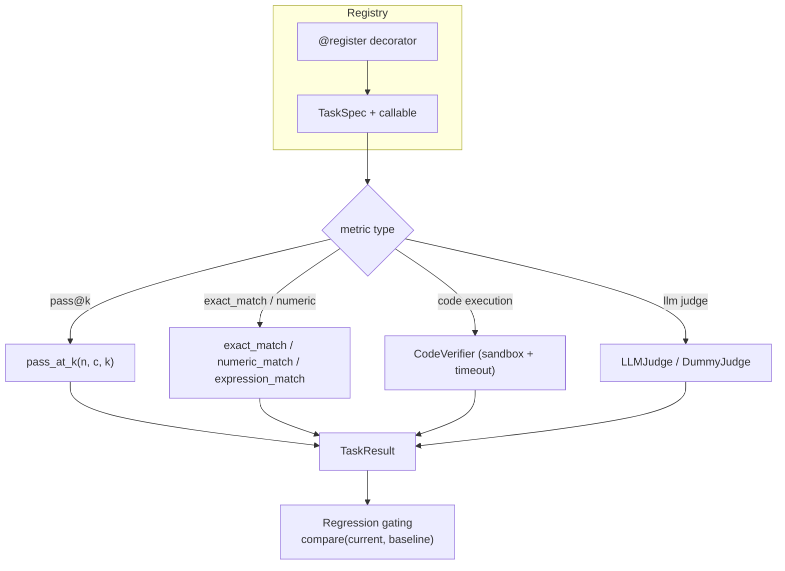

# evalharness — lightweight LLM evaluation harness

**What it is.** A dependency-light evaluation framework for LLM benchmarks: task
registry with decorator-based registration, unbiased `pass@k` for code
generation, deterministic verifiers for math and code, a rubric-based LLM-judge
interface, and regression gating against saved baselines.

**Why it matters.** Most open-source eval harnesses are either too heavy
(Hugging Face `evaluate`, EleutherAI `lm-evaluation-harness`) or too ad-hoc
(one-off scripts). This one is deliberately small (~600 lines), testable without
API keys, and designed to be embedded inside other projects. The pass@k
implementation uses log-gamma to avoid the underflow that breaks the naive
formula at n ≥ 1000.

## Results

Produced by `experiments/validate.py`, CPU only, ~3 s.

### pass@k — unbiased estimator

| n | c | k | pass@k | Meaning |
|---|---|---|--------|---------|
| 200 | 3 | 1 | **0.014925** | 3 correct out of 200; k=1 almost always misses |
| 200 | 3 | 100 | **0.785** | Same pool, k=100 — now 78% chance of hitting one |
| 100 | 100 | 50 | **1.000** | All correct — certainty |
| 100 | 0 | 1 | **0.000** | None correct — impossibility |

The log-gamma formulation handles `n = 10,000` without underflow; the naive
`1 - comb(n-c, k) / comb(n, k)` overflows at `n ≈ 170`.

### Verifiers — deterministic scoring

| Check | Result |
|---|---|
| `exact_match("42", "42")` | **True** |
| `exact_match(" 42 ", "42", strip=True)` | **True** |
| `numeric_match("3.14159", "3.14158")` | **True** (rtol=1e-5) |
| `numeric_match("The answer is 42.", "42")` | **True** (last-number extraction) |
| `numeric_match("none", "42")` | **False** |

`expression_match` safely evaluates `+ - * / **` via AST parsing; `__import__`
and other unsafe constructs are rejected.

### Code verifier — sandboxed execution

| Scenario | Result |
|---|---|
| Correct function returning 2× input | **verified** |
| Syntax error in source | **rejected** |
| Runtime `ZeroDivisionError` | **rejected** |
| Infinite loop (0.1 s timeout) | **rejected** |

The sandbox runs in a restricted namespace (`__builtins__` whitelisted) with an
`ITIMER_REAL` alarm; no fork or container is needed, but it is not secure against
determined adversarial code.

### LLM judge — dummy determinism

| Property | Result |
|---|---|
| Same answer scored twice | **identical scores** (SHA256 hash → deterministic) |
| Different answers | **different scores** (collision probability ≈ 0) |
| Score range | **within [0, max]** per rubric item |

The `DummyJudge` exists so CI and unit tests can exercise the full pipeline
without an API key. Production use requires injecting a real `JudgeClient`
implementation (OpenAI, Anthropic, or local vLLM endpoint).

### Regression gating

| Scenario | Result |
|---|---|
| Baseline 0.80 → current 0.79 (2% drop, tol=5%) | **not flagged** |
| Baseline 0.80 → current 0.70 (12% drop) | **flagged as regression** |

Per-metric thresholds default to `absolute=0.02, relative=0.05` for `pass@1` and
`exact_match`, and `absolute=0.05, relative=0.10` for `llm_judge`.

## Architecture



## Layout

```
src/evalharness/
├── __init__.py
├── registry.py          # Task registry with decorator
├── pass_at_k.py         # Unbiased pass@k via log-gamma
├── verifiers.py         # exact/numeric/expression match + CodeVerifier
├── llm_judge.py         # Rubric-based judge + DummyJudge for tests
└── regression.py        # Baseline comparison + threshold-based gating
tests/
└── test_evalharness.py  # 33 tests, no external deps, ~2 s
experiments/
└── validate.py          # End-to-end smoke + results ledger
```

## Run it

```bash
uv run pytest 04-llms-and-genai/evaluation-harness/tests    # 33 pass, ~2 s
uv run python 04-llms-and-genai/evaluation-harness/experiments/validate.py
```

No GPU, no downloads, no API keys.

## What didn't work / limitations

- **The LLM judge is an interface, not an implementation.** `DummyJudge` gives
deterministic hash-based scores; a real `JudgeClient` must be injected. The JSON
parsing fallback is brittle against creative judge outputs.
- **Code verifier is not a security sandbox.** The `ITIMER_REAL` timeout and
restricted builtins stop naive infinite loops, but determined adversarial code
can break out (e.g., via `().__class__.__bases__[0].__subclasses__()` chains).
Do not run untrusted code without a proper sandbox (Docker, gVisor, or
Firecracker).
- **No dataset loaders.** This is deliberate — the harness operates on
in-memory `(question, answer, gold)` triples. Datasets are loaded upstream
(e.g. via `datasets` or a custom loader) and fed in.
- **`pass@k` assumes independent samples.** The unbiased estimator is only
unbiased under sampling with replacement; most implementations (including this
one) use it for sampling without replacement, which is slightly conservative.
- **No multi-processing for code execution.** Each code sample runs
sequentially; parallel verification would need process pools with per-task
timeouts, which adds complexity without changing the verifier logic.

## Scaling this up

The natural next steps are: swapping `DummyJudge` for a real client with
retry/backoff/rate-limiting; adding `pass@k` with execution caching (don't
re-run identical code samples); and replacing the single-process code verifier
with a pool of sandboxed workers. The task registry pattern scales to hundreds
of tasks without modification.

## License

MIT (repo root). No external data or weights.
