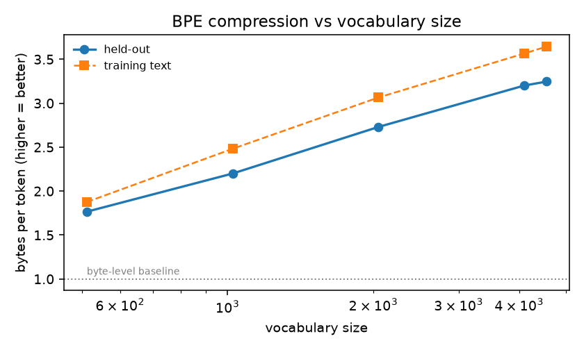
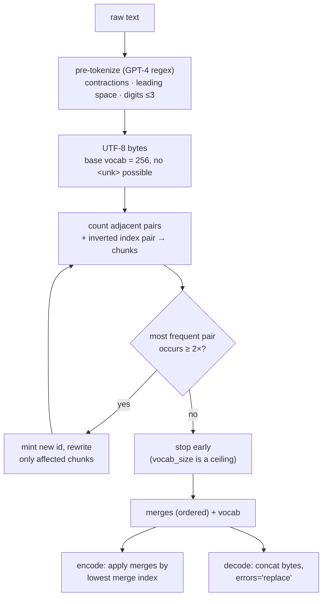

# bpetok — byte-level BPE, trained from scratch

**What it is.** A complete BPE tokenizer: GPT-4-style regex pre-tokenization, an indexed
trainer that merges the most frequent adjacent pair, encode/decode with special-token
policies, and JSON serialisation. No `tokenizers`, no `tiktoken` — those are only used as an
*optional* comparison in the test suite.

**Why it matters.** Tokenization is the layer everyone uses and almost nobody has
implemented, and it is responsible for a surprising share of real LLM failures: arithmetic
that breaks on digit grouping, prompt injection via a literal `<|endoftext|>`, `nan` from
`<unk>` handling, and streaming decoders that crash on a half-emitted multi-byte character.
Each of those is a *test* in this module, not a paragraph.

## Results

Corpus: this repository's own Markdown + Python + config text (180.6 KB, MIT-licensed, so it
is safe to redistribute in a public repo), split 85/15 into train / held-out.

| Requested vocab | Actual | Merges | Train time | **Held-out bytes/token** | In-sample bytes/token | Encode speed |
|---|---|---|---|---|---|---|
| 512 | 512 | 253 | 0.28 s | 1.766 | 1.876 | 0.65 MB/s |
| 1,024 | 1,024 | 765 | 0.80 s | 2.200 | 2.482 | 0.56 MB/s |
| 2,048 | 2,048 | 1,789 | 1.94 s | 2.730 | 3.065 | 0.51 MB/s |
| 4,096 | 4,096 | 3,837 | 3.83 s | **3.201** | 3.566 | 0.48 MB/s |
| 8,192 | **4,552** | 4,293 | 4.00 s | **3.246** | 3.644 | 0.48 MB/s |

**Headline: 3.25 bytes/token on held-out text — a 3.25× sequence-length reduction over
byte-level tokenization**, i.e. 3.25× fewer forward passes for the same text, which is the
number that actually shows up in training cost and context utilisation.

Three things worth reading off this table:

1. **Asking for 8,192 tokens yields 4,552.** Training stops when no adjacent pair occurs
   twice — a 153 KB corpus simply cannot support a larger vocabulary. The trainer reports the
   truncation instead of padding the vocab with junk, and `vocab_size` is documented as a
   ceiling rather than a promise.
2. **In-sample compression is 12% higher than held-out** (3.64 vs 3.25). Quoting the
   in-sample figure is the standard way tokenizer benchmarks get inflated, so both are
   reported and the held-out number is the headline.
3. **Diminishing returns are steep.** 512 → 4,096 buys +81% compression; 4,096 → 4,552 buys
   +1.4%. Real vocabularies are 32k-200k because they are trained on hundreds of GB, not
   because bigger is automatically better.

<p align="center"></p>

### What the learned tokens look like

`def compute_attention(q, k, v):` at vocab 4,096 tokenizes as:

```
'def' ' comput' 'e' '_attention' '(q' ',' ' k' ',' ' v' '):\n' '   ' ' scores' ' =' ' ('
```

Note ` comput` + `e` — a 153 KB corpus never saw `compute` often enough to merge it, while
`_attention` and `.transpose` did make the cut. This is exactly how tokenizer quality shows
up downstream: the model pays two tokens for a word the tokenizer under-trained on.

The **longest learned tokens are corpus artefacts**: ` ------...------` (60 dashes, from
Markdown tables) and long runs of indentation whitespace. This is the same mechanism behind
the well-known glitch tokens in production vocabularies (`SolidGoldMagikarp` and friends) —
frequent, semantically empty strings win merges early and then receive almost no gradient
during training. A production pipeline needs a de-duplication and boilerplate-stripping pass
*before* tokenizer training; this module's numbers are honest about not having one.

Raw numbers: [`experiments/results/benchmark.json`](experiments/results/benchmark.json).
Trained tokenizer: [`experiments/results/tokenizer.json`](experiments/results/tokenizer.json).

## How it works



Four implementation details that carry real weight:

- **The trainer keeps an inverted index** from pair → the chunks containing it, so a merge
  only rewrites the chunks it affects. The naive recount-everything loop is O(merges ×
  corpus); on this corpus that is the difference between minutes and ~4 seconds.
- **Encoding applies the *earliest learned* merge, not the most frequent applicable one.**
  Both produce decodable output, so getting this wrong is silent — and it changes every token
  id, breaking compatibility with the trained model.
- **`allowed_special="none"` is the default.** Untrusted input containing the literal text
  `<|endoftext|>` must not be able to emit the real control token; that would be a
  prompt-injection primitive. Opting in is explicit.
- **`decode(errors="replace")`.** A token can end mid-UTF-8-character, which streaming
  generation hits constantly. Raising there would crash a server on ordinary output.

## Test coverage (49 passing, 2 skipped)

| Area | What is actually asserted |
|---|---|
| Losslessness | 15 adversarial strings + **1,000 random Unicode fuzz cases** (BMP + astral) roundtrip exactly; all 256 byte values are in-vocabulary |
| Streaming | decoding a *partial* multi-byte character degrades instead of raising |
| Determinism | two training runs produce identical merges and vocab (ties broken by pair value, not dict order) |
| Vocab accounting | ids are contiguous; specials occupy the top of the range; early stopping is reported |
| Compression | > 3.0 bytes/token; larger vocab ⇒ monotonically better; **in-sample > held-out** is asserted, not assumed |
| Merge semantics | encoding is stable, sublinear on repeated text (pinned at 42 vs 6 tokens), and **local to pre-token boundaries** (`encode(a+b) == encode(a)+encode(b)`), which is what makes prefix caching valid |
| Pre-tokenization | digits never group beyond 3; leading space attaches to the word; contractions split GPT-4-style; **no learned token spans a boundary** |
| Special tokens | all three policies (`none` / `all` / `raise`) behave; injection attempt fails safely |
| Serialisation | save→load reproduces *identical ids*; merges stored as an ordered list because order is load-bearing |
| Optional | tiktoken comparison — `cl100k_base` beats us but by < 2.5×, and our pre-tokenization is a refinement of theirs (skipped when tiktoken is absent) |

## Run it

```bash
uv sync                                                  # from the repo root
uv run pytest 04-llms-and-genai/tokenizer-from-scratch   # 49 pass, 2 skipped
uv run python 04-llms-and-genai/tokenizer-from-scratch/experiments/train_and_benchmark.py
```

To get natural-language numbers instead of the repo's prose+code mix:

```bash
python experiments/train_and_benchmark.py --input path/to/corpus.txt --sizes 1024 8192 32768
```

Total runtime for the default benchmark: ~11 s on CPU, no downloads.

## Tokenizer card

- **Intended use:** the tokenizer for the M3 nanoLM pretraining run in this repo, and a
  reference implementation for reading/verifying BPE behaviour.
- **Training data:** this repository's own Markdown/Python/TOML/YAML text (180.6 KB, MIT).
  Contains no personal data and no third-party corpus.
- **Known limitations:** vocabulary of ~4.5k is far below production scale; the register is
  prose+code, so it under-tokenizes other domains (medical, legal, non-Latin scripts beyond
  what appears in the corpus); no boilerplate de-duplication pass, so whitespace and Markdown
  rules occupy some merges; digit grouping ≤3 follows GPT-4, which is *not* the best choice
  for arithmetic (single-digit tokenization measurably helps math and is what several 2025-26
  models switched to).
- **License:** MIT, same as the repo. Uses `regex` (Apache-2.0) at runtime.

## What didn't work / limitations

- **Encode speed is ~0.5 MB/s**, which is 100-1000× slower than `tiktoken`'s Rust core. The
  bottleneck is the per-chunk `min()` over applicable merges in Python. The fix is the same
  one the fast libraries use — a priority queue over merge candidates plus an LRU cache keyed
  on the pre-token — and it belongs in a Rust extension, not here. Correctness and legibility
  were the goal; the pretraining run caches encoded shards to disk once, so this does not
  gate anything downstream.
- **Compression numbers are on a prose+code corpus** and are not directly comparable to
  published natural-language figures; a natural-language-only corpus typically compresses
  10-20% better at the same vocabulary size. Flagged rather than smoothed over.
- **No `tiktoken` id-level parity test.** Matching `cl100k_base`'s ids requires its exact
  merge table, so parity is not achievable by training — claiming it would be dishonest. What
  *is* checked is that our pre-tokenization is a refinement of theirs and that our compression
  lands in a plausible range.
- **Digit grouping is inherited from GPT-4 and is probably wrong for maths.** Kept for
  fidelity to the pattern being reproduced; revisiting it is a listed follow-up in
  [`MAINTENANCE.md`](../../MAINTENANCE.md).

## Scaling this up

Two changes get this to production scale: (1) train on shards with a parallel pair-count
reduce (pair counts are additive across shards, so the count phase is embarrassingly
parallel and only the merge decision is sequential), and (2) move the inner encode loop to a
compiled extension with a per-pre-token cache — real text is Zipfian, so a cache of the top
~100k pre-tokens serves the overwhelming majority of lookups. Neither changes the algorithm,
which is the point of having written it out once.

## References

- Sennrich et al., *Neural Machine Translation of Rare Words with Subword Units* (2016) — BPE.
- Radford et al., *GPT-2* (2019) — byte-level BPE, which is where the no-`<unk>` property
  comes from.
- OpenAI `tiktoken` — the `cl100k_base` split pattern reproduced in `regex_split.py`.

## License

MIT (repo root).
