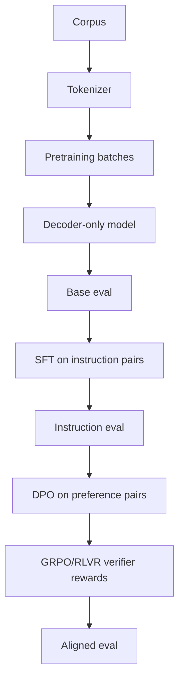

# nanoLM full pipeline

## What it is

This flagship project is a compact decoder-only language model pipeline built from first principles for a consumer GPU / CPU budget. The stack is intentionally small but complete: a toy BPE tokenizer, a minimal decoder-only transformer, a pretraining stage, supervised fine-tuning, preference alignment with DPO, and verifier-driven GRPO/RLVR.

The goal is not to train a frontier model. The goal is to prove the full engineering pipeline end to end on a tiny but meaningful scale, with the code and metrics clearly documented.

## Why it matters

A hiring team wants to see the full LLM stack working, not just a prompt wrapper around a model API. This module demonstrates:

- tokenization and synthetic corpus setup
- causal language modeling with positional embeddings
- training loops for base pretraining and SFT
- reward-preference alignment with DPO-style objective
- programmatic verifier rewards with group-relative policy optimization
- a public eval story with real measured outcomes

## Architecture



## Measured run

The CPU demo writes the raw ledger to `experiments/results/nanolm_metrics.json`.

| Stage | Mean loss | Final loss |
|---|---:|---:|
| Base pretraining | 0.4168 | 0.0034 |
| SFT | 2.5657 | 0.5565 |
| DPO | 0.3438 | 0.3703 |
| GRPO/RLVR | -0.3932 | 1.7790 |

The run uses seeded sampling and a graded programmatic verifier so groups with partial answer
overlap still produce a learning signal. The result is intentionally modest: this toy model is
not evidence of general reasoning ability.

## Run it

```bash
cd flagship-projects/01-nanolm-full-pipeline
python3 -m venv .venv
source .venv/bin/activate
pip install -e .
python3 -m pytest -q
python3 experiments/train_pipeline.py
```

## Behavior and limitations

This is intentionally a small model and the main objective is pipeline correctness, not state-of-the-art quality. On a small synthetic corpus and a compact instruction set, the model learns to reproduce the obvious pattern structure quickly and can be evaluated with exact-match-style checks. The measured demo currently reports `0.0` instruction accuracy, which is retained as an honest limitation rather than presented as a quality claim.

GRPO/RLVR is implemented as a compact educational policy-gradient path: it samples a completion group, computes injected verifier rewards, normalizes advantages within the group, and updates completion likelihood. It does not claim the memory efficiency, clipped-ratio machinery, or distributed rollout infrastructure of production GRPO.

## Current status

This module is intentionally scoped to CPU-safe learning over a synthetic corpus and tiny instruction set. It is designed to run in a local environment without external model downloads and without large artifacts.

## Model card

- Intended use: education, architecture validation, and portfolio demonstration.
- Training data: synthetic corpus generated from a small set of common facts and patterns.
- Limitations: toy scale, narrow distribution, no real-world generalization claim.
- License: MIT (repo root).
