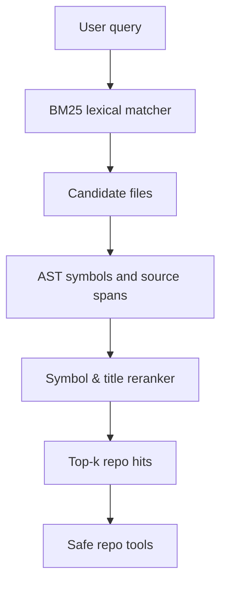

# codebase-copilot

## What it is

This flagship project packages a compact codebase-search stack that mirrors the workflow of an internal repo copilot: index a small corpus, score candidate files by lexical relevance, and rerank them with a cheap symbolic signal. The design is intentionally lean enough for a portfolio demo while still reflecting the engineering choices used by modern repo assistants.

## Why it matters

Real code search is not just a vector database; it is a retrieval system with a strong lexical baseline and a reranker that understands file names, symbols, and task wording. This module demonstrates:

- lexical BM25-style retrieval over a synthetic code corpus
- Python AST-aware chunks with qualified symbols and source spans
- title/path overlap bonuses for likely file matches
- reranking of candidate results before returning them
- path-safe `search`, bounded `read_file`, and non-mutating `propose_patch` tools
- a clean API for codebase search that can later be extended to embeddings or AST-aware retrieval

## Architecture



## Run it

```bash
cd flagship-projects/02-codebase-copilot
python3 -m venv .venv
source .venv/bin/activate
pip install -e .
python3 -m pytest -q
python3 experiments/demo_search.py
```

## Demo behavior

This project uses a small corpus of code-like documents such as:

- `tokenizer.py` — BPE tokenizer logic
- `train.py` — training loops
- `retriever.py` — search and ranking code
- `eval.py` — scoring and verification utilities

A typical query such as "how do we train the tokenizer and score validation" will rank the matching files before less relevant ones.

## Current status

This is a compact retrieval-and-reranking system that is intentionally small, CPU-safe, and easy to reason about. Python documents can be indexed with `Document.from_python_source`, which extracts class/function symbols and preserves their source spans for later read-and-patch tools. It is designed to become the basis for a much richer repo-agent stack in later milestones while still giving a clear, readable demo now.

`CodebaseTools` keeps repository operations deliberately conservative: reads are bounded and
root-scoped, and patch proposals require exactly one matching replacement and return a unified
diff without modifying the working tree. This is the contract an MCP or planning layer can
wrap later.

## Model card

- Intended use: codebase search, repo-navigation demo, and retrieval-system portfolio piece.
- Training data: synthetic repo-like docs generated in the demo script and tests.
- Limitations: no embeddings, no cross-encoder, no real multi-repo memory, and AST extraction currently targets Python; the object is to show ranking quality and system design rather than production scale.
- License: MIT (repo root).
